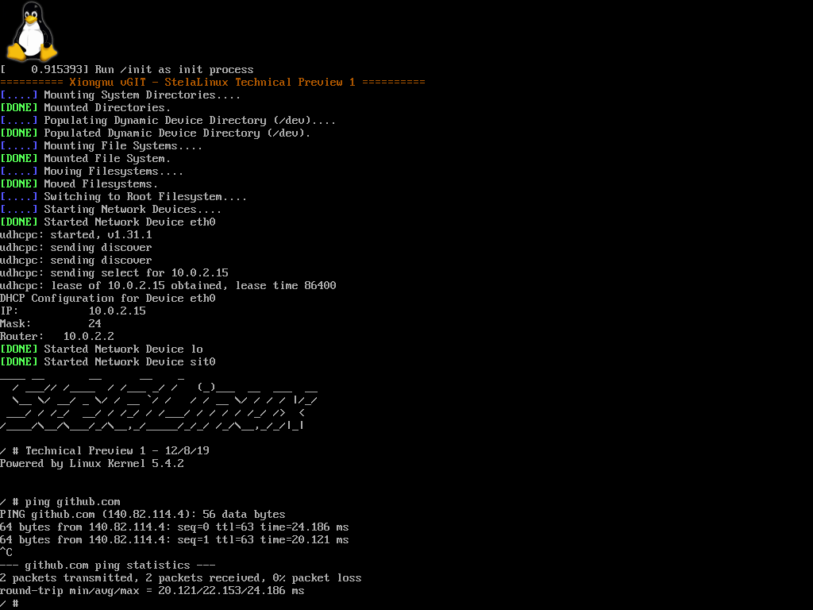

# StelaLinux - A Minimal Linux Distribution

I have experimented with this type of project in the past, with AwlBuntu, AwlsomeLinux, MLL, and StarLinux, but now I want to finish it. StelaLinux (Stela is Esperanto for Star) is **hopefully** the last iteration before StelaLinux can be a production standard for my Minimal Linux Distribution. This repository contains scripts needed to build StelaLinux and create the packages for the package repository. 

I decided to take a different approach for StelaLinux and instead of using only a minimal subset of the GNU C Library, I will instead use the fully capable musl libc library and build all of the packages (including the Linux Kernel) using that. 

## Kerno Features:
* Latest LTS Linux Kernel (5.4)
* musl libc (1.1.24)
* BusyBox Userland Stable (1.31.1)
* In-house INIT Scripts (TBD)

## How to Build:
### Dependencies (Ubuntu 18.04/19.10 & Debian 10):

`sudo apt install wget make gcc g++ bc bison pv flex xorriso libelf-dev libssl-dev unzip`

### musl-gcc wrapper:

Cross Compiler Toolchain provided via musl.cc

### stelalinux.sh Script:
* `stelalinux.sh toolchain`: Downloads and prepares the musl-gcc Cross Compiler
* `stelalinux.sh build (package)`: Builds a specific package to be installed to StelaLinux
* `stelalinux.sh initramfs`: Generates an initramfs for StelaLinux to boot off of
* `stelalinux.sh image`: Generates a bootable StelaLinux Live Image with Syslinux Bootloader

## How to Install:
**Install via ArchLinux (Experimental)**

TO BE ADDED

**Install via Install Script**

TO BE DEVELOPED!

## Developer:
* AwlsomeAlex (Project Manager)

## Special Thanks:
* Ivandavidov (MLL)
* zv.io (MUSL Cross Compiler)
* protonesso (Very Helpful Contributor)
